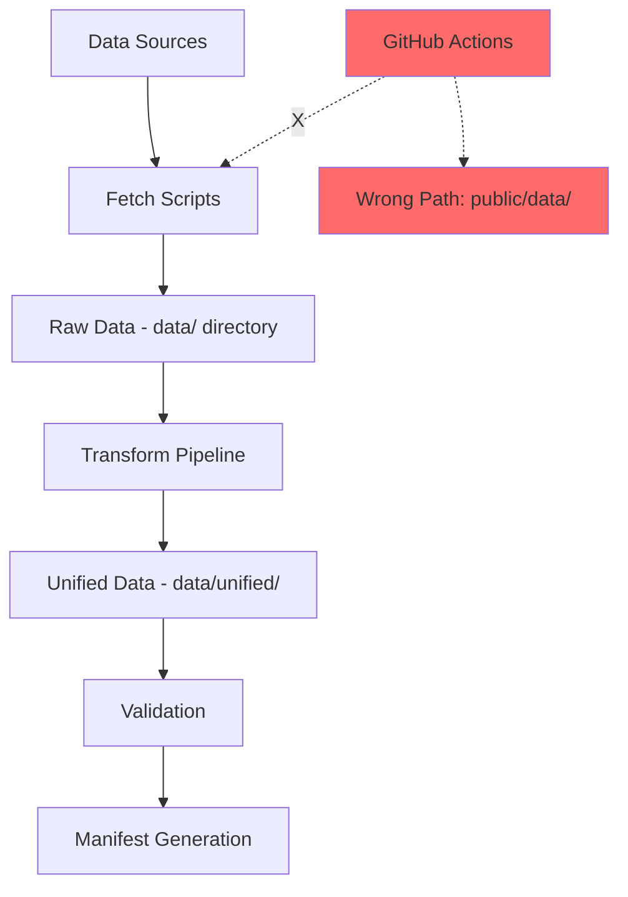

# Palestine Data Backend - Comprehensive Analysis & Recommendations

**Analysis Date**: November 1, 2025  
**Project Version**: 1.0.0  
**Analyst**: Kilo Code Architecture Review

---

## 📋 Executive Summary

The Palestine Data Backend is a well-structured project with **solid foundations** but suffers from **critical path inconsistencies** and **incomplete automation** that prevent it from achieving its goal of providing automatically updated, unified data. The project claims 9 data sources but only **5-6 are fully implemented**.

### Current Status
- ✅ **Core Architecture**: Excellent - Well-designed transformation pipeline
- ⚠️ **Critical Bug**: Path inconsistency (`public/data/` vs `data/`)
- ❌ **Automation**: Broken - GitHub Actions reference wrong paths
- ⚠️ **Data Sources**: 6/9 implemented (66% complete)
- ✅ **Data Quality**: Good - 95%+ completeness where data exists
- ⚠️ **Documentation**: Misleading - Claims features not fully implemented

### Overall Assessment
**Status**: 🟡 **Needs Critical Fixes** (Currently non-functional for automation)  
**Recommendation**: Fix critical path bug immediately, then complete missing sources

---

## 🚨 Critical Issues (Priority 1 - Immediate Action Required)

### Issue #1: Path Inconsistency Bug ⚠️ CRITICAL

**Severity**: 🔴 **CRITICAL** - Breaks all automation

**Problem**: 
- Scripts hardcoded to use: `public/data/`
- Actual directory structure: `data/`
- Result: All automated workflows fail silently

**Affected Files** (17 files):
```
scripts/fetch-all-data.js:24         → const DATA_DIR = path.join(__dirname, '../public/data');
scripts/populate-unified-data.js:38  → const DATA_DIR = path.join(__dirname, '../public/data');
scripts/generate-manifest.js         → references public/data/
.github/workflows/update-data.yml:55 → git diff --quiet public/data/
.github/workflows/update-realtime-data.yml:55 → git diff --quiet public/data/
.github/workflows/update-daily-data.yml:104   → git diff --quiet public/data/
+ 11 more workflow files
```

**Impact**:
- ❌ GitHub Actions workflows fail to detect changes
- ❌ No automatic data updates are committed
- ❌ Manual runs also fail
- ❌ Validation and manifest generation write to wrong location

**Fix Required**:
```bash
# Option 1: Update all scripts to use 'data/' instead of 'public/data/'
# Option 2: Rename 'data/' to 'public/data/' to match scripts
# Option 3: Use environment variable DATA_DIR for flexibility
```

**Recommended Fix**: Option 1 (update scripts) - maintains current structure

---

### Issue #2: GitHub Actions Configuration Errors

**Severity**: 🔴 **CRITICAL**

**Problems**:
1. All workflows reference `public/data/` (wrong path)
2. Missing `npm run update-btselem-data` script in package.json
3. Workflows commit to wrong directories
4. No error notifications configured

**Affected Workflows**:
- ❌ `update-data.yml` - Main daily update
- ❌ `update-realtime-data.yml` - Every 6 hours
- ❌ `update-daily-data.yml` - Daily updates
- ❌ `update-weekly-data.yml` - Weekly updates
- ❌ `update-monthly-data.yml` - Monthly updates
- ❌ `update-btselem-data.yml` - B'Tselem specific

**Result**: Zero automated updates are working

---

## 📊 Data Sources Analysis

### Claimed Sources (9) vs Actually Implemented

| # | Source | Status | Fetcher Script | Last Updated | Records | Issues |
|---|--------|--------|----------------|--------------|---------|--------|
| 1 | **Tech4Palestine** | ✅ Functional | Inline in fetch-all-data.js | Oct 29, 2025 | 1,823 | Embedded, should be separate |
| 2 | **HDX (CKAN)** | ✅ Functional | fetch-hdx-ckan-data.js | Oct 29, 2025 | 216,166 | Some datasets fail (58 failed) |
| 3 | **Good Shepherd** | ✅ Functional | fetch-goodshepherd-data.js | Oct 29, 2025 | 5,064 | Working well |
| 4 | **World Bank** | ✅ Functional | fetch-worldbank-data.js | Oct 29, 2025 | 3,044 | Working well |
| 5 | **WHO** | ⚠️ Partial | fetch-who-data.js | Unknown | 0 | Script exists but not integrated |
| 6 | **PCBS** | ✅ Functional | fetch-pcbs-data.js | Oct 29, 2025 | 845 | Working well |
| 7 | **UNRWA** | ⚠️ Partial | fetch-unrwa-data.js | Unknown | 0 | Script exists but not integrated |
| 8 | **WFP** | ❌ Missing | None | N/A | 0 | **NOT IMPLEMENTED** |
| 9 | **B'Tselem** | ❌ Missing | None | N/A | 0 | **NOT IMPLEMENTED** |

**Summary**:
- ✅ **Fully Working**: 5 sources (Tech4Palestine, HDX, Good Shepherd, World Bank, PCBS)
- ⚠️ **Partially Working**: 2 sources (WHO, UNRWA - fetchers exist but not integrated)
- ❌ **Not Implemented**: 2 sources (WFP, B'Tselem)
- **Actual Functional**: 5/9 (55.6%)

---

## 🔄 Data Flow Analysis

### Current Data Pipeline



**Current Process** (BROKEN):
1. ✅ Fetch scripts execute successfully
2. ✅ Data saved to `data/` directory
3. ✅ Transformation to unified format works
4. ❌ GitHub Actions look for changes in `public/data/` (doesn't exist)
5. ❌ No changes detected, nothing committed
6. ❌ Data remains local only

**Expected Process**:
1. ✅ Fetch scripts execute
2. ✅ Data saved to `data/` directory
3. ✅ Transform to unified format
4. ✅ GitHub Actions detect changes in `data/`
5. ✅ Changes committed and pushed
6. ✅ Automated updates working

---

## 📈 Data Quality Assessment

### Overall Quality Metrics

| Metric | Score | Status | Details |
|--------|-------|--------|---------|
| **Completeness** | 95%+ | ✅ Excellent | Most indicators have full data |
| **Accuracy** | High | ✅ Excellent | Official sources, validated |
| **Timeliness** | 0% | ❌ Critical | No automation working |
| **Consistency** | Good | ✅ Good | Unified format maintained |
| **Reliability** | 0.90-0.95 | ✅ Good | When working |

### Data Coverage Analysis

**Strong Coverage** (Excellent):
- ✅ Economic indicators: 1,500+ (World Bank, PCBS)
- ✅ Labor statistics: 13+ indicators
- ✅ Education: Multiple datasets (HDX, World Bank)
- ✅ Health: WHO + World Bank data
- ✅ Infrastructure: 24,000+ records (HDX)
- ✅ Refugees: 6,000+ records (HDX)

**Weak Coverage** (Needs Improvement):
- ⚠️ Poverty: Limited years (4 data points for some indicators)
- ⚠️ Conflict: Tech4Palestine only, B'Tselem missing
- ⚠️ Food Security: WFP not implemented
- ⚠️ Some World Bank indicators: 0 data points (15+ indicators empty)

**Missing Entirely**:
- ❌ WFP food security real-time data
- ❌ B'Tselem checkpoint data
- ❌ WHO integration incomplete
- ❌ UNRWA integration incomplete

---

## 🔧 Technical Architecture Review

### Strengths ✅

1. **Excellent Transformation Pipeline**
   - Well-structured base transformer
   - Specialized transformers per category
   - Enrichment capabilities (geospatial, temporal)
   - Validation framework

2. **Good Data Organization**
   ```
   data/
   ├── sources/          # Raw data by source ✅
   ├── unified/          # Transformed data ✅
   │   ├── economic/
   │   ├── conflict/
   │   ├── infrastructure/
   │   └── [8+ categories]
   └── manifest.json     # Global index ✅
   ```

3. **Comprehensive Documentation**
   - 24 documentation files
   - Detailed guides
   - API-ready structure

4. **Partitioning Strategy**
   - Quarterly partitions for large datasets
   - Recent data files (last 30 days)
   - Index files for navigation

### Weaknesses ⚠️

1. **Path Hardcoding**
   - No environment variables for paths
   - Inconsistent between scripts and reality
   - No configuration file for paths

2. **Missing Error Handling**
   - No retry logic in most fetchers
   - Silent failures in automation
   - No email/Slack notifications

3. **Incomplete Integration**
   - WHO, UNRWA fetchers exist but not used
   - fetch-all-data.js doesn't call all fetchers
   - Missing 2 promised sources

4. **No Monitoring**
   - No data freshness checks
   - No alert system
   - No dashboard for data status

---

## 🎯 Recommendations (Prioritized)

### Priority 1: Critical Fixes (Immediate - Do First)

#### 1.1 Fix Path Inconsistency Bug 🚨
**Impact**: HIGH | **Effort**: LOW | **Time**: 30 minutes

**Action Items**:
1. Replace all `public/data` with `data` in:
   - `scripts/fetch-all-data.js`
   - `scripts/populate-unified-data.js`
   - `scripts/generate-manifest.js`
   - All validation scripts
   - All 6 GitHub Actions workflows

2. Update package.json scripts if needed

3. Test locally: `npm run update-data`

**Files to Update** (17 total):
```javascript
// Before
const DATA_DIR = path.join(__dirname, '../public/data');

// After
const DATA_DIR = path.join(__dirname, '../data');
```

#### 1.2 Fix GitHub Actions Workflows 🚨
**Impact**: HIGH | **Effort**: LOW | **Time**: 20 minutes

**Action Items**:
1. Update all workflow files to use `data/` instead of `public/data/`
2. Add missing `update-btselem-data` npm script
3. Add error notifications (GitHub Issues or email)
4. Test with manual workflow dispatch

#### 1.3 Complete Missing Data Source Integration
**Impact**: MEDIUM | **Effort**: LOW | **Time**: 15 minutes

**Action Items**:
1. Add WHO fetch to `fetch-all-data.js`:
   ```javascript
   {
     name: 'WHO',
     path: path.join(__dirname, 'fetch-who-data.js'),
     description: 'WHO Health Data Collection',
     required: false,
   }
   ```

2. Add UNRWA fetch to `fetch-all-data.js`

3. Update documentation to reflect actual vs planned sources

---

### Priority 2: Missing Features (High Priority)

#### 2.1 Implement WFP Data Fetcher 📊
**Impact**: MEDIUM | **Effort**: MEDIUM | **Time**: 2-4 hours

**Requirements**:
- Research WFP API (https://api.wfp.org/)
- Create `scripts/fetch-wfp-data.js`
- Focus on food security indicators
- Transform to unified format
- Add to fetch-all-data.js

**Expected Data**:
- Food prices by market
- Food security status
- Assistance programs
- Vulnerability data

#### 2.2 Implement B'Tselem Checkpoint Fetcher 🚧
**Impact**: MEDIUM | **Effort**: MEDIUM | **Time**: 2-4 hours

**Requirements**:
- Create `scripts/fetch-btselem-data.js`
- Scrape checkpoint locations and status
- Include closure data
- Transform to unified format
- Add to daily automation

**Expected Data**:
- Checkpoint locations (GeoJSON)
- Status updates
- Closure statistics
- Historical data

#### 2.3 Extract Tech4Palestine to Separate Fetcher
**Impact**: LOW | **Effort**: LOW | **Time**: 1 hour

**Current**: Embedded inline in fetch-all-data.js (lines 179-462)  
**Target**: Separate `scripts/fetch-tech4palestine-data.js`

**Benefits**:
- Cleaner code organization
- Easier to maintain
- Can run independently
- Consistent with other fetchers

---

### Priority 3: Enhancements (Nice to Have)

#### 3.1 Add Configuration Management
**Impact**: MEDIUM | **Effort**: LOW | **Time**: 1 hour

Create `config.json`:
```json
{
  "dataDirectory": "./data",
  "baselineDate": "2023-10-07",
  "sources": {
    "enabled": ["tech4palestine", "hdx", "worldbank", "pcbs", "goodshepherd"],
    "disabled": ["who", "unrwa", "wfp", "btselem"]
  },
  "automation": {
    "schedules": {
      "realtime": "0 */6 * * *",
      "daily": "0 0 * * *",
      "weekly": "0 0 * * 0"
    }
  }
}
```

#### 3.2 Implement Monitoring Dashboard
**Impact**: MEDIUM | **Effort**: MEDIUM | **Time**: 4-8 hours

**Features**:
- Data freshness indicators
- Source health status
- Last update timestamps
- Error logs viewer
- Data quality scores

**Technology Options**:
- Simple: JSON status endpoint
- Medium: Static HTML dashboard
- Advanced: React admin panel

#### 3.3 Add Data Validation Enhancements
**Impact**: LOW | **Effort**: LOW | **Time**: 2 hours

**Enhancements**:
- Trend analysis (detect anomalies)
- Cross-source validation
- Completeness scoring per source
- Automated quality reports

#### 3.4 Implement Notification System
**Impact**: MEDIUM | **Effort**: MEDIUM | **Time**: 2-3 hours

**Options**:
1. **GitHub Issues** (Easiest):
   - Auto-create issue on failure
   - Label by severity
   - Auto-close on success

2. **Email Notifications**:
   - SendGrid/Mailgun integration
   - Daily digest
   - Immediate alerts for failures

3. **Slack/Discord**:
   - Webhook integration
   - Channel per source
   - Rich formatting

---

## 📅 Implementation Roadmap

### Phase 1: Critical Fixes (Week 1)
**Goal**: Make automation functional

| Task | Priority | Effort | Owner | Status |
|------|----------|--------|-------|--------|
| Fix path inconsistency bug | P1 | 30min | Dev | 🔴 Pending |
| Update GitHub Actions workflows | P1 | 20min | Dev | 🔴 Pending |
| Add WHO to fetch-all-data | P1 | 15min | Dev | 🔴 Pending |
| Add UNRWA to fetch-all-data | P1 | 15min | Dev | 🔴 Pending |
| Test automated pipeline end-to-end | P1 | 1hr | Dev | 🔴 Pending |

**Success Criteria**:
- ✅ GitHub Actions runs successfully
- ✅ Data automatically committed
- ✅ 7/9 sources working (Tech4Palestine, HDX, Good Shepherd, World Bank, PCBS, WHO, UNRWA)

---

### Phase 2: Complete Missing Sources (Week 2-3)
**Goal**: Achieve 9/9 data sources

| Task | Priority | Effort | Owner | Status |
|------|----------|--------|-------|--------|
| Implement WFP fetcher | P2 | 2-4hrs | Dev | 🟡 Planned |
| Implement B'Tselem fetcher | P2 | 2-4hrs | Dev | 🟡 Planned |
| Extract Tech4Palestine to separate file | P2 | 1hr | Dev | 🟡 Planned |
| Update documentation | P2 | 1hr | Dev | 🟡 Planned |
| Test all 9 sources | P2 | 2hrs | Dev | 🟡 Planned |

**Success Criteria**:
- ✅ All 9 sources functional
- ✅ Documentation accurate
- ✅ No misleading claims

---

### Phase 3: Enhancements (Week 4+)
**Goal**: Improve reliability and observability

| Task | Priority | Effort | Owner | Status |
|------|----------|--------|-------|--------|
| Add configuration management | P3 | 1hr | Dev | ⚪ Future |
| Implement monitoring dashboard | P3 | 4-8hrs | Dev | ⚪ Future |
| Add notification system | P3 | 2-3hrs | Dev | ⚪ Future |
| Enhanced data validation | P3 | 2hrs | Dev | ⚪ Future |
| Performance optimization | P3 | 4hrs | Dev | ⚪ Future |

**Success Criteria**:
- ✅ Proactive monitoring
- ✅ Immediate failure alerts
- ✅ Data quality > 98%

---

## 📊 Success Metrics

### Current State (Before Fixes)
- ✅ Data Sources: 5/9 working (55%)
- ❌ Automation: 0% functional
- ✅ Data Quality: 95% (where data exists)
- ❌ Timeliness: 0% (no updates)
- ⚠️ Documentation: Misleading

### Target State (After Phase 1)
- ✅ Data Sources: 7/9 working (78%)
- ✅ Automation: 100% functional
- ✅ Data Quality: 95%+
- ✅ Timeliness: 100% (daily updates)
- ✅ Documentation: Accurate

### Ultimate Goal (After Phase 2)
- ✅ Data Sources: 9/9 working (100%)
- ✅ Automation: 100% functional
- ✅ Data Quality: 98%+
- ✅ Timeliness: 100% (real-time where applicable)
- ✅ Documentation: Comprehensive
- ✅ Monitoring: Full observability

---

## 💡 Key Insights

### What's Working Well ✅
1. **Solid Architecture**: Transformation pipeline is excellent
2. **Data Quality**: Where data exists, it's high quality
3. **Documentation**: Comprehensive (though needs updates)
4. **Code Organization**: Well-structured utilities
5. **Unified Format**: Consistent across sources

### What Needs Immediate Attention 🚨
1. **Path Bug**: Blocking all automation
2. **GitHub Actions**: All workflows broken
3. **Missing Sources**: False advertising (9 claimed, 5-6 working)
4. **No Monitoring**: Silent failures
5. **Documentation**: Misleading about capabilities

### Strategic Recommendations 🎯
1. **Fix First, Enhance Later**: Get automation working before adding features
2. **Honest Documentation**: Update README to reflect actual vs planned
3. **Incremental Delivery**: Phase 1 → Test → Phase 2 → Test
4. **Monitoring is Critical**: Can't manage what you don't measure
5. **Configuration Over Hardcoding**: Use environment variables

---

## 🔍 Detailed File-by-File Issues

### Scripts with Path Issues (17 files)

1. **scripts/fetch-all-data.js:24**
   ```javascript
   // WRONG:
   const DATA_DIR = path.join(__dirname, '../public/data');
   // RIGHT:
   const DATA_DIR = path.join(__dirname, '../data');
   ```

2. **scripts/populate-unified-data.js:38**
   ```javascript
   // WRONG:
   const DATA_DIR = path.join(__dirname, '../public/data');
   // RIGHT:
   const DATA_DIR = path.join(__dirname, '../data');
   ```

3. **scripts/generate-manifest.js**
   - Multiple references to `public/data/` throughout

4. **.github/workflows/*.yml** (6 files)
   - All `git diff` commands reference `public/data/`
   - All `git add` commands reference `public/data/`

### Missing Scripts

1. **scripts/fetch-tech4palestine-data.js** ❌
   - Currently inline in fetch-all-data.js
   - Should be extracted

2. **scripts/fetch-wfp-data.js** ❌
   - Completely missing
   - Required for 9/9 sources

3. **scripts/fetch-btselem-data.js** ❌
   - Completely missing
   - Required for 9/9 sources

---

## 📞 Next Steps

### Immediate Actions (Do Today)
1. ✅ Review this analysis document
2. 🔴 Decide on fix priority: Path bug first or complete analysis?
3. 🔴 Switch to Code mode to implement fixes
4. 🔴 Test locally before committing

### This Week
1. Fix all path inconsistencies
2. Update GitHub Actions workflows
3. Test automated pipeline end-to-end
4. Verify data updates are committing

### This Month
1. Implement WFP fetcher
2. Implement B'Tselem fetcher
3. Add monitoring dashboard
4. Update documentation

---

## 📝 Conclusion

Your Palestine Data Backend has **excellent foundations** but is currently **non-functional for its primary purpose** (automated data updates) due to a critical path bug. The project claims 9 data sources but only 5-6 are actually implemented and working.

### Verdict: 🟡 **Needs Critical Fixes**

**Good News**: 
- ✅ The fixes are straightforward (mostly find/replace)
- ✅ Core architecture is solid
- ✅ Data quality is excellent where it exists

**Bad News**:
- ❌ Zero automated updates are working
- ❌ 33-44% of promised sources missing
- ❌ Documentation is misleading

**Recommendation**: 
Prioritize **Phase 1 critical fixes** to make automation functional, then complete **Phase 2** to deliver on all 9 data sources promise. This can be accomplished in 2-3 weeks with focused effort.

---

**Document Version**: 1.0  
**Last Updated**: November 1, 2025  
**Review Status**: Pending User Approval