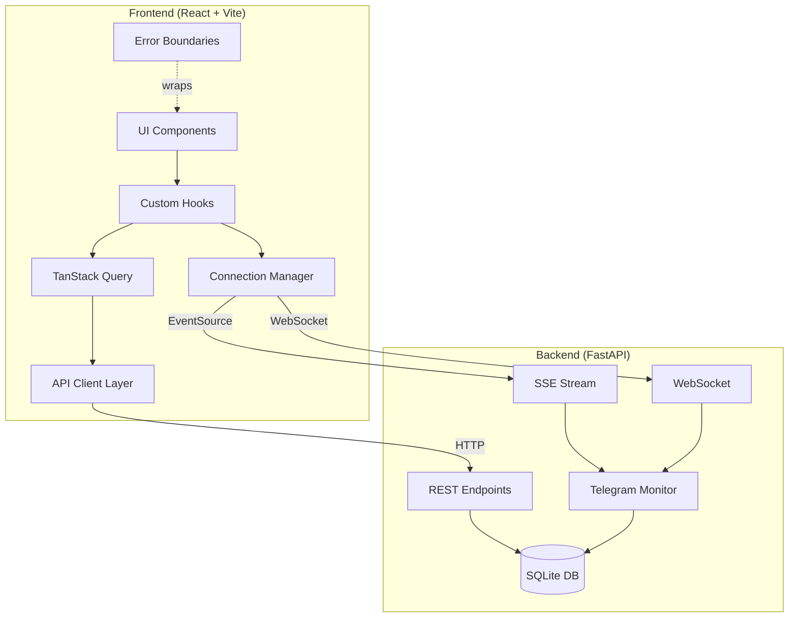
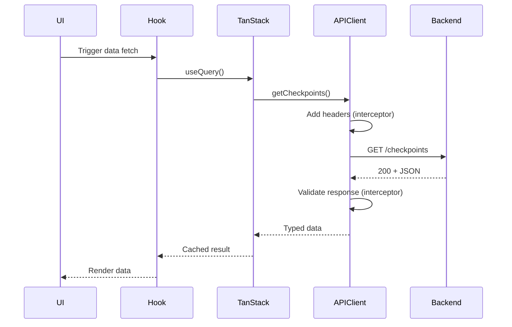
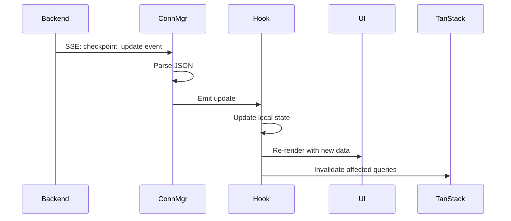
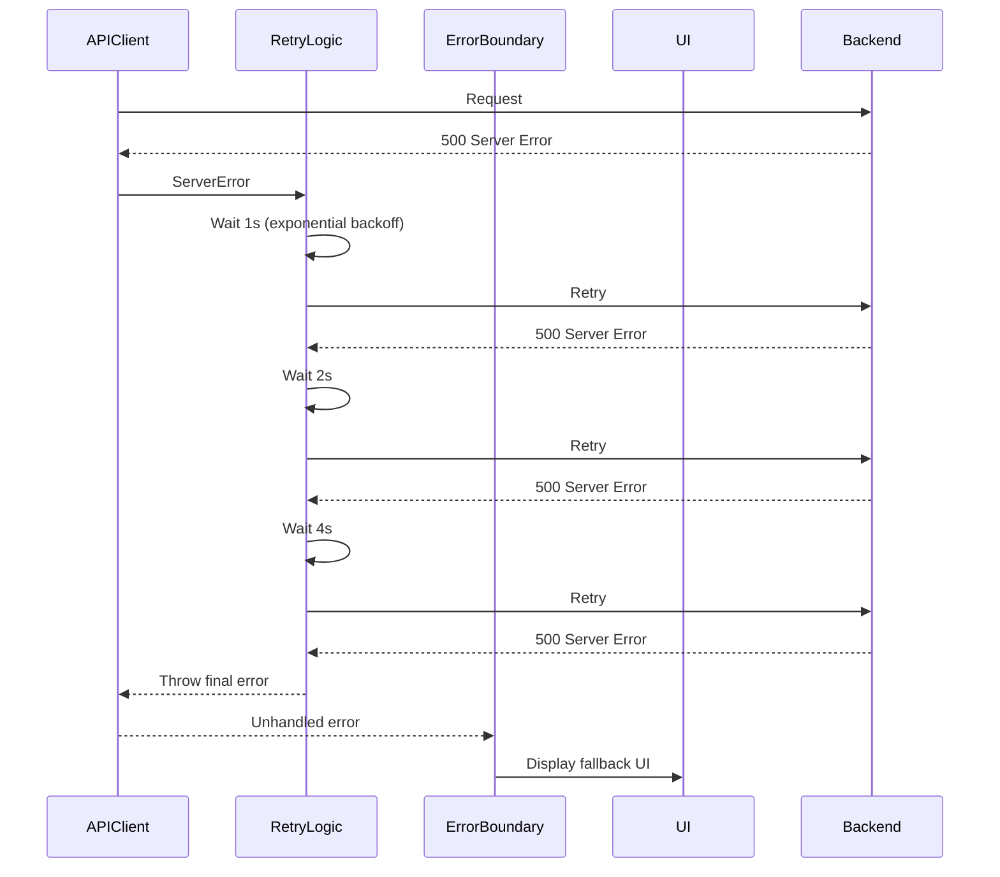
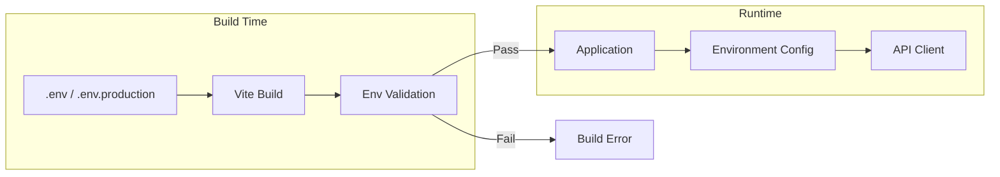
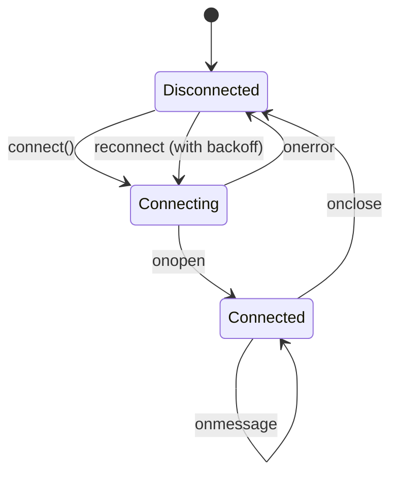

# Design Document: API-Frontend Integration Audit

## Overview

This design addresses the integration gap between the West Bank Alert System's production FastAPI backend and its React frontend, which was initially built with mock data. The system monitors Telegram channels for security alerts and checkpoint status updates, providing real-time information through REST APIs, WebSocket, and Server-Sent Events (SSE).

The integration audit focuses on six critical areas:

1. **API Client Layer**: Centralized HTTP communication with type safety, error handling, and request lifecycle management
2. **Real-time Connection Management**: Robust SSE/WebSocket handling with automatic reconnection and state tracking
3. **Error Handling**: Comprehensive error classification, React Error Boundaries, and user-friendly messaging
4. **Performance Optimization**: Efficient data fetching, pagination, debouncing, and map rendering
5. **Environment Configuration**: Build-time and runtime configuration for seamless deployment across environments
6. **Production Readiness**: Build optimization, monitoring, accessibility, and deployment configuration

The design maintains the existing frontend architecture (React 18, TypeScript, Vite, TanStack Query, Wouter, Leaflet) while adding production-grade integration patterns.

## Architecture

### High-Level System Architecture



### Data Flow Patterns

**REST Request Flow:**


**Real-time Update Flow:**


**Error Handling Flow:**


### Environment Configuration Flow



## Components and Interfaces

### API Client Layer

**File Structure:**
```
src/lib/
├── api/
│   ├── client.ts          # Core HTTP client with interceptors
│   ├── endpoints.ts       # Typed endpoint functions
│   ├── errors.ts          # Custom error classes
│   ├── retry.ts           # Retry logic with exponential backoff
│   ├── types.ts           # TypeScript interfaces for API models
│   └── index.ts           # Public exports
```

**Core Client Interface:**
```typescript
// src/lib/api/client.ts
interface APIClientConfig {
  baseURL: string;
  timeout: number;
  headers: Record<string, string>;
  retryConfig: RetryConfig;
}

interface RequestInterceptor {
  onRequest: (config: RequestConfig) => RequestConfig | Promise<RequestConfig>;
}

interface ResponseInterceptor {
  onResponse: (response: Response) => Response | Promise<Response>;
  onError: (error: Error) => Error | Promise<Error>;
}

class APIClient {
  private config: APIClientConfig;
  private requestInterceptors: RequestInterceptor[];
  private responseInterceptors: ResponseInterceptor[];
  
  constructor(config: APIClientConfig);
  
  // Core methods
  get<T>(url: string, options?: RequestOptions): Promise<T>;
  post<T>(url: string, data: unknown, options?: RequestOptions): Promise<T>;
  delete<T>(url: string, options?: RequestOptions): Promise<T>;
  
  // Interceptor management
  addRequestInterceptor(interceptor: RequestInterceptor): void;
  addResponseInterceptor(interceptor: ResponseInterceptor): void;
  
  // Request cancellation
  createAbortController(): AbortController;
}
```

**Endpoint Functions:**
```typescript
// src/lib/api/endpoints.ts
export async function getAlerts(params?: AlertQueryParams): Promise<Alert[]>;
export async function getLatestAlerts(n?: number): Promise<Alert[]>;
export async function getCheckpoints(params?: CheckpointQueryParams): Promise<Checkpoint[]>;
export async function getCheckpointSummary(): Promise<CheckpointSummary>;
export async function getCheckpointGeoJSON(status?: string): Promise<GeoJSONFeatureCollection>;
export async function getStats(): Promise<Stats>;
export async function getCheckpointStats(): Promise<CheckpointStats>;
export async function getHealth(): Promise<HealthResponse>;
```

**Error Classes:**
```typescript
// src/lib/api/errors.ts
class APIError extends Error {
  constructor(
    message: string,
    public statusCode?: number,
    public responseBody?: unknown
  );
}

class NetworkError extends APIError {}
class TimeoutError extends APIError {}
class NotFoundError extends APIError {}
class AuthenticationError extends APIError {}
class RateLimitError extends APIError {
  constructor(message: string, public retryAfter: number);
}
class ServerError extends APIError {}
```

### Connection Manager

**Connection State Machine:**


**Connection Manager Interface:**
```typescript
// src/lib/realtime/ConnectionManager.ts
type ConnectionStatus = 'connected' | 'connecting' | 'disconnected';
type ConnectionType = 'sse' | 'websocket';

interface ConnectionConfig {
  url: string;
  type: ConnectionType;
  reconnectDelays: number[]; // [2000, 5000, 10000, 30000]
  heartbeatInterval?: number;
}

interface ConnectionManager {
  status: ConnectionStatus;
  connect(): void;
  disconnect(): void;
  on(event: string, handler: (data: unknown) => void): void;
  off(event: string, handler: (data: unknown) => void): void;
}

class SSEConnectionManager implements ConnectionManager {
  private eventSource: EventSource | null;
  private reconnectAttempts: number;
  private reconnectTimer: number | null;
  
  connect(): void;
  disconnect(): void;
  private handleMessage(event: MessageEvent): void;
  private handleError(event: Event): void;
  private scheduleReconnect(): void;
}

class WebSocketConnectionManager implements ConnectionManager {
  private socket: WebSocket | null;
  private pingInterval: number | null;
  private reconnectAttempts: number;
  
  connect(): void;
  disconnect(): void;
  private sendPing(): void;
  private handleMessage(event: MessageEvent): void;
  private handleClose(event: CloseEvent): void;
  private scheduleReconnect(): void;
}
```

**Custom Hook:**
```typescript
// src/hooks/useRealtime.ts
interface UseRealtimeOptions {
  connectionType?: 'sse' | 'websocket';
  onAlert?: (alert: Alert) => void;
  onCheckpointUpdate?: (update: CheckpointUpdate) => void;
}

interface UseRealtimeReturn {
  alerts: Alert[];
  checkpointUpdates: CheckpointUpdate[];
  connectionStatus: ConnectionStatus;
  reconnect: () => void;
}

export function useRealtime(options?: UseRealtimeOptions): UseRealtimeReturn;
```

### Error Boundary Implementation

```typescript
// src/components/ErrorBoundary.tsx
interface ErrorBoundaryProps {
  children: React.ReactNode;
  fallback?: (error: Error, reset: () => void) => React.ReactNode;
  onError?: (error: Error, errorInfo: React.ErrorInfo) => void;
}

interface ErrorBoundaryState {
  hasError: boolean;
  error: Error | null;
}

class ErrorBoundary extends React.Component<ErrorBoundaryProps, ErrorBoundaryState> {
  static getDerivedStateFromError(error: Error): ErrorBoundaryState;
  componentDidCatch(error: Error, errorInfo: React.ErrorInfo): void;
  reset(): void;
  render(): React.ReactNode;
}
```

**Error Boundary Placement:**
```typescript
// src/App.tsx
<ErrorBoundary fallback={(error, reset) => <AppErrorFallback error={error} onReset={reset} />}>
  <Router>
    <Dashboard />
  </Router>
</ErrorBoundary>

// src/pages/Dashboard.tsx
<ErrorBoundary fallback={(error, reset) => <ComponentErrorFallback error={error} onReset={reset} />}>
  <MapView />
</ErrorBoundary>

<ErrorBoundary fallback={(error, reset) => <ComponentErrorFallback error={error} onReset={reset} />}>
  <LiveFeed />
</ErrorBoundary>
```

### TanStack Query Configuration

```typescript
// src/lib/queryClient.ts
import { QueryClient } from '@tanstack/react-query';

export const queryClient = new QueryClient({
  defaultOptions: {
    queries: {
      staleTime: 5 * 60 * 1000, // 5 minutes for static data
      gcTime: 10 * 60 * 1000, // 10 minutes garbage collection
      retry: 3,
      retryDelay: (attemptIndex) => Math.min(1000 * 2 ** attemptIndex, 30000),
      refetchOnWindowFocus: true,
      refetchOnReconnect: true,
    },
  },
});

// Query key factory
export const queryKeys = {
  alerts: {
    all: ['alerts'] as const,
    list: (filters: AlertQueryParams) => ['alerts', 'list', filters] as const,
    latest: (n: number) => ['alerts', 'latest', n] as const,
    detail: (id: number) => ['alerts', 'detail', id] as const,
  },
  checkpoints: {
    all: ['checkpoints'] as const,
    list: (filters: CheckpointQueryParams) => ['checkpoints', 'list', filters] as const,
    summary: () => ['checkpoints', 'summary'] as const,
    geojson: (status?: string) => ['checkpoints', 'geojson', status] as const,
    stats: () => ['checkpoints', 'stats'] as const,
  },
  health: () => ['health'] as const,
  stats: () => ['stats'] as const,
};
```

**Custom Query Hooks:**
```typescript
// src/hooks/useCheckpoints.ts
export function useCheckpoints(filters?: CheckpointQueryParams) {
  return useQuery({
    queryKey: queryKeys.checkpoints.list(filters || {}),
    queryFn: () => getCheckpoints(filters),
    staleTime: 30 * 1000, // 30 seconds for dynamic data
  });
}

export function useCheckpointSummary() {
  return useQuery({
    queryKey: queryKeys.checkpoints.summary(),
    queryFn: getCheckpointSummary,
    staleTime: 30 * 1000,
    refetchInterval: 30 * 1000, // Poll every 30 seconds
  });
}

export function useCheckpointGeoJSON(status?: string) {
  return useQuery({
    queryKey: queryKeys.checkpoints.geojson(status),
    queryFn: () => getCheckpointGeoJSON(status),
    staleTime: 60 * 1000, // 1 minute cache
  });
}
```

## Data Models

### TypeScript Interfaces

```typescript
// src/lib/api/types.ts

// Enums
export type AlertType = 
  | 'west_bank_siren'
  | 'regional_attack'
  | 'idf_raid'
  | 'settler_attack'
  | 'road_closure'
  | 'flying_checkpoint'
  | 'injury_report'
  | 'rocket_attack'
  | 'idf_operation'
  | 'airstrike'
  | 'explosion'
  | 'shooting'
  | 'general';

export type Severity = 'critical' | 'high' | 'medium' | 'low';

export type CheckpointStatus = 
  | 'open'
  | 'closed'
  | 'congested'
  | 'slow'
  | 'military'
  | 'unknown';

export type ConnectionStatus = 'connected' | 'connecting' | 'disconnected';

// Alert Models
export interface Alert {
  id: number;
  type: AlertType;
  severity: Severity;
  title: string;
  body: string;
  source: string;
  source_msg_id?: number;
  area?: string;
  raw_text: string;
  timestamp: string; // ISO 8601
  created_at: string; // ISO 8601
  event_subtype?: string;
  latitude?: number;
  longitude?: number;
}

export interface AlertQueryParams {
  type?: AlertType;
  severity?: Severity;
  area?: string;
  since?: string; // ISO 8601
  page?: number;
  per_page?: number;
}

export interface AlertResponse {
  alerts: Alert[];
  total: number;
  page: number;
  per_page: number;
}

// Checkpoint Models
export interface Checkpoint {
  canonical_key: string;
  name_ar: string;
  name_en?: string;
  region?: string;
  latitude?: number;
  longitude?: number;
  status: CheckpointStatus;
  status_raw?: string;
  confidence: 'high' | 'medium' | 'low';
  crowd_reports_1h: number;
  last_updated: string; // ISO 8601
  last_source_type?: 'admin' | 'crowd';
  last_active_hours?: number;
  is_stale: boolean;
}

export interface CheckpointQueryParams {
  status?: CheckpointStatus;
  region?: string;
  active?: boolean;
  since?: string; // ISO 8601
}

export interface CheckpointListResponse {
  checkpoints: Checkpoint[];
  total: number;
  snapshot_at: string; // ISO 8601
}

export interface CheckpointUpdate {
  id?: number;
  canonical_key: string;
  name_raw: string;
  status: CheckpointStatus;
  status_raw?: string;
  source_type: 'admin' | 'crowd';
  source_channel: string;
  source_msg_id?: number;
  raw_line?: string;
  raw_message?: string;
  timestamp: string; // ISO 8601
  created_at?: string; // ISO 8601
}

export interface CheckpointSummary {
  by_status: Record<CheckpointStatus, number>;
  fresh_last_1h: number;
  fresh_last_6h: number;
  total_active: number;
  last_update: string; // ISO 8601
  is_data_stale: boolean;
}

// Statistics Models
export interface Stats {
  total_alerts: number;
  alerts_last_24h: number;
  alerts_last_hour: number;
  by_type: Record<AlertType, number>;
  by_severity: Record<Severity, number>;
  by_area: Record<string, number>;
  monitored_channels: string[];
  uptime_seconds: number;
}

export interface CheckpointStats {
  total_checkpoints: number;
  total_directory: number;
  total_with_geo: number;
  by_status: Record<CheckpointStatus, number>;
  by_confidence: Record<string, number>;
  updates_last_1h: number;
  updates_last_24h: number;
  admin_updates_24h: number;
  monitored_channel: string;
  snapshot_at: string; // ISO 8601
}

// Health Models
export interface HealthResponse {
  status: 'ok' | 'degraded' | 'down';
  uptime_seconds: number;
  ws_clients: number;
  sse_clients: number;
  cp_ws_clients: number;
  cp_sse_clients: number;
  monitor: {
    connected: boolean;
    last_message_at?: string; // ISO 8601
    messages_today: number;
    alerts_today: number;
    cp_updates_today: number;
  };
  checkpoints: {
    last_update?: string; // ISO 8601
    is_stale: boolean;
  };
  timestamp: string; // ISO 8601
}

// GeoJSON Models
export interface GeoJSONFeature {
  type: 'Feature';
  geometry: {
    type: 'Point';
    coordinates: [number, number]; // [longitude, latitude]
  };
  properties: {
    canonical_key: string;
    name_ar: string;
    name_en?: string;
    region?: string;
    status: CheckpointStatus;
    confidence: string;
    last_updated: string; // ISO 8601
    last_source_type?: string;
  };
}

export interface GeoJSONFeatureCollection {
  type: 'FeatureCollection';
  features: GeoJSONFeature[];
  metadata: {
    total: number;
    snapshot_at: string; // ISO 8601
  };
}

// Environment Configuration
export interface EnvironmentConfig {
  API_BASE_URL: string;
  WS_BASE_URL: string;
  API_VERSION: string;
  ENABLE_MOCK_DATA: boolean;
  ENABLE_DEBUG_LOGGING: boolean;
}
```

### Configuration File Structure

```typescript
// src/config/environment.ts
export const environment: EnvironmentConfig = {
  API_BASE_URL: import.meta.env.VITE_API_BASE_URL || '',
  WS_BASE_URL: import.meta.env.VITE_WS_BASE_URL || '',
  API_VERSION: import.meta.env.VITE_API_VERSION || 'v1',
  ENABLE_MOCK_DATA: import.meta.env.VITE_ENABLE_MOCK_DATA === 'true',
  ENABLE_DEBUG_LOGGING: import.meta.env.DEV || import.meta.env.VITE_DEBUG === 'true',
};

// Validation at build time
export function validateEnvironment(): void {
  const required = ['API_BASE_URL'] as const;
  const missing = required.filter(key => !environment[key] && !import.meta.env.DEV);
  
  if (missing.length > 0) {
    throw new Error(
      `Missing required environment variables: ${missing.join(', ')}\n` +
      'Please check your .env file and ensure all required variables are set.'
    );
  }
}

// Call validation on module load in production
if (import.meta.env.PROD) {
  validateEnvironment();
}
```

**.env.example:**
```bash
# API Configuration
VITE_API_BASE_URL=http://localhost:8080
VITE_WS_BASE_URL=ws://localhost:8080
VITE_API_VERSION=v1

# Feature Flags
VITE_ENABLE_MOCK_DATA=false
VITE_DEBUG=false

# Production Example
# VITE_API_BASE_URL=https://api.wb-alerts.example.com
# VITE_WS_BASE_URL=wss://api.wb-alerts.example.com
```

## Correctness Properties

*A property is a characteristic or behavior that should hold true across all valid executions of a system—essentially, a formal statement about what the system should do. Properties serve as the bridge between human-readable specifications and machine-verifiable correctness guarantees.*

